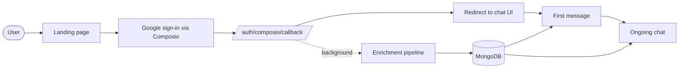
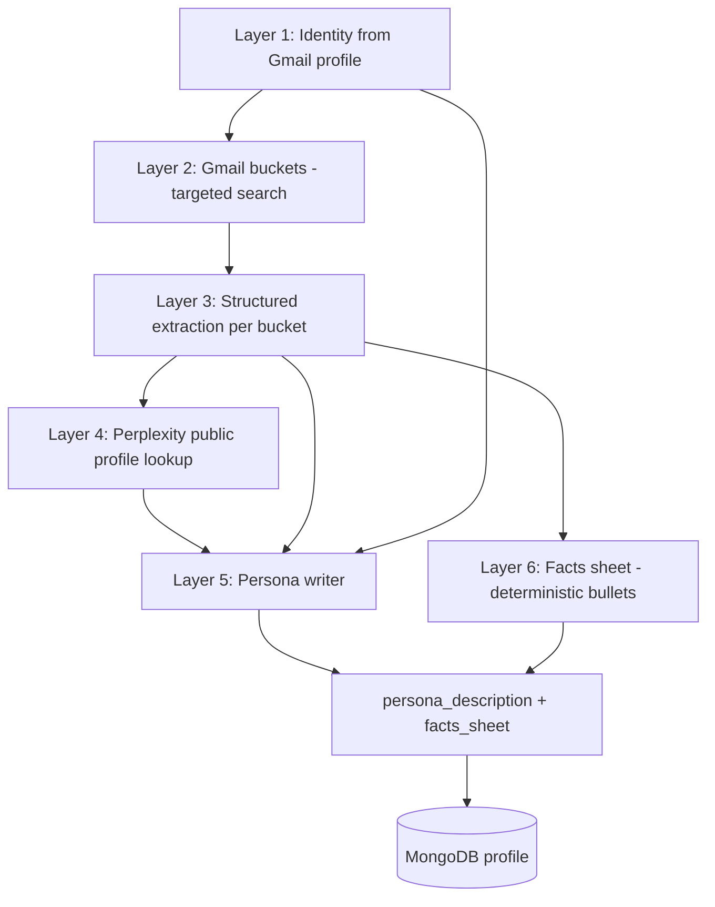
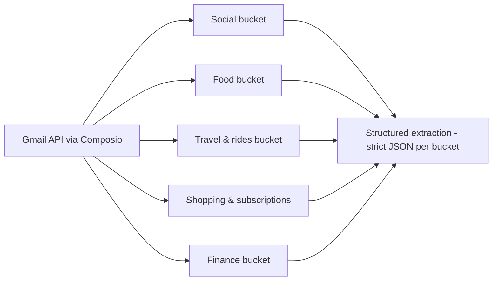

# faff — personalised onboarding from Gmail

**faff** is a small onboarding + chat experience in the **web app**: users sign in with Google (Gmail), and the app builds a rich picture of who they are from **email signals** and **public web context**, then chats with them in a tone that feels like you already know them—not like a generic assistant.

This README explains **how enrichment works** and **how that turns into the “wow” first message and ongoing replies**, without walking line-by-line through the codebase.

---

## What makes the experience feel unique

Traditional onboarding asks users to fill forms. Here, the product **infers context** from data they already have in Gmail (order receipts, travel confirmations, social notifications, etc.) and **augments** that with a web lookup so role, company, and public presence line up with the right person.

Two things power the chat layer:

1. **Persona description** — a short, human-readable brief (identity + tone + what we’re unsure about). It’s written by a dedicated “persona writer” step so the bot has a stable voice and doesn’t treat every message like a cold start.

2. **Facts sheet** — a **deterministic** bullet list of concrete, grounded facts (restaurants, cities, destinations, handles, subscriptions, etc.). It is built directly from structured extraction outputs, **not** re-summarised by a model, so specifics don’t get washed out into vague phrases like “likes food” or “travels sometimes.”

Every reply is instructed to use **at most one** concrete callback per message so it feels sharp, not creepy or list-like.

---

## End-to-end user journey (high level)

1. **Landing** — User opens the web app and starts Google sign-in through **Composio** (Gmail OAuth).

2. **Session** — Each run gets a stable **entity ID** (Composio user id) that ties together the browser session, stored profile, and chat history.

3. **After OAuth** — Enrichment runs **in the background** so the user isn’t blocked on slow steps (Gmail search, multiple LLM calls, Perplexity). The UI can move to chat while the profile is still building.

4. **Profile stored** — When enrichment finishes, a **user profile** plus a full **enrichment payload** (all bucket outputs, Perplexity snapshot, persona snapshot) is saved to **MongoDB**.

5. **First message in the UI** — The first reply is generated using the persona + facts sheet so it can reference something **specific and surprising** if the data supports it.

6. **Ongoing chat** — Later messages use the same persona + facts sheet in the system context, with conversation history for continuity.

If enrichment fails or isn’t ready yet, the product **degrades gracefully** (warm generic greeting) instead of breaking.

---

## How enrichment works (the pipeline)

Enrichment is a **pipeline**, not a single API call. Think of it in layers.

### Layer 1 — Identity from Google / Gmail

- **Gmail profile** gives display name and email address; if the name is missing, a simple fallback derives a readable name from the local part of the email.
- **Company domain** is inferred when useful: work emails expose the domain directly; for personal inboxes (Gmail, etc.), the pipeline may look at **contact domains** from Google People search to guess a likely work domain as a weak hint—not a fact, but useful for disambiguation later.

### Layer 2 — Gmail “buckets” (targeted search, not “read everything”)

Instead of ingesting the whole mailbox, the app runs **several focused Gmail searches** (India-first sender and subject patterns by default), each capped to a limited number of recent messages. Buckets include:

- **Social** — Instagram, Facebook, LinkedIn notification mail (handles, LinkedIn URLs, headlines in footers).
- **Food** — Delivery and order-confirmation style mail (Swiggy, Zomato, Uber Eats–style patterns).
- **Travel & rides** — Uber, Ola, travel aggregators, airlines, hotels, itineraries.
- **Shopping & subscriptions** — E‑commerce and recurring services (Amazon, Flipkart, streaming, etc.).
- **Finance** — Transaction-style alerts from major Indian bank senders (used only in **coarse** ways downstream; see Privacy below).

Each bucket’s emails are **trimmed** (long bodies truncated) before any model sees them, to keep cost and noise under control.

### Layer 3 — Structured extraction (per bucket)

For each bucket, a **small, fast language model** is asked to return **strict JSON**: only facts that appear in the email text, plus **confidence** and **extraction notes**. This is the main guard against hallucination at the email layer.

Social email also keeps **regex fallbacks** (e.g. LinkedIn `/in/...` URLs, Instagram handles) when the structured extractor misses something.

### Layer 4 — Public web enrichment (Perplexity)

**Perplexity** (configured similarly to a “Pro Search” style agent) receives:

- Name, email, optional company-domain hint  
- Structured social signals (handles, LinkedIn URL, headline snippets)

It returns a **compact JSON profile**: role, company, short bio, LinkedIn URL, location, and public-interest keywords—**with explicit instruction to use null when something isn’t confidently findable**, so the system doesn’t invent a career.

### Layer 5 — Persona writer (tone + identity paragraph)

A second, stronger model pass **merges** identity, all bucket extractions, and Perplexity into a **short persona description**: who they seem to be, how to talk to them, and what’s still unknown. The prompt is tuned so vague filler (“occasional traveller”) is discouraged when the extractors already named real places or habits.

### Layer 6 — Facts sheet (verbatim specifics, no extra LLM)

Separately, a **pure string builder** (no LLM) turns the structured outputs into a **bullet list of concrete facts**: cuisines, restaurant names, cities, trip destinations, ride apps, shopping platforms, notable items, subscriptions, public interests, etc.

**Finance content is intentionally not copied into this sheet** as merchant lines or bank identifiers—the goal is lifestyle signal without turning the bot into a statement reader.

Together, **persona description + facts sheet** give the chat model both **narrative tone** and **pickable specifics** for the wow moment.

---

## What gets stored

Persisted per user (conceptually):

- **Flat profile fields** — Name, email, first name, role, company, bio, LinkedIn, location (as returned by the pipeline when available).
- **`persona_description`** — The persona writer output (chat’s “who is this person” memory).
- **`facts_sheet`** — The deterministic bullet list of grounded specifics.
- **`enrichment`** — Full structured payload for debugging and product iteration: per-bucket insights, Perplexity snapshot, persona snapshot, schema version, timestamps.

Conversation turns are stored separately (keyed by `entity_id`) so ongoing chat has history without re-sending the entire enrichment on every token.

---

## Privacy, grounding, and product boundaries

- **Grounding first** — Extractors are told not to invent; Perplexity is told to use null when unsure; the persona writer is told not to fabricate.
- **No “financial dossier”** — Bank and card alert mail may inform **coarse** lifestyle inference in the persona layer, but the **facts sheet** does not enumerate finance merchants or institutions for the chat model to quote.
- **One detail per message** — Chat instructions cap how many private specifics surface in a single reply, to stay witty rather than surveillance-like.
- **User control** — Scope is whatever Gmail OAuth and Composio expose; treating this as a production product implies clear copy in the UI about **what categories of email inform personalization** and an honest **opt-out or delete** story as you scale.

---

## Tech stack (at a glance)

- **Backend** — FastAPI  
- **Auth / Gmail access** — Composio (Gmail tools: profile, people search, search/fetch messages)  
- **Database** — MongoDB (Motor) for users, profiles, and chat history  
- **Models** — OpenAI (extraction + persona + chat), Perplexity Agent API (public profile resolution)  

Environment variables are listed in `.env.example` (API keys, Mongo URL, public base URL for OAuth redirect).

---

## Running locally

You’ll need Docker (or local Python + MongoDB), the keys above, and a **public HTTPS URL** (e.g. ngrok) for the OAuth callback if you test Gmail end-to-end.

Typical flow:

1. Copy `.env.example` to `.env` and fill in values.  
2. Start services (e.g. `docker compose up`).  
3. Open the app root, complete Google sign-in, then use the in-app chat.

---

## Summary

**faff** builds a **layered enrichment pipeline**: targeted Gmail buckets → structured extraction → public web profile → persona paragraph + deterministic facts sheet → personalised **in-app** chat. The design intentionally separates **tone memory** (persona) from **verbatim hooks** (facts sheet) so the onboarding feels specific and surprising without dumping raw JSON or the entire mailbox into every prompt.

If you extend the product, the highest-leverage knobs are usually **better bucket queries** (what mail you pull) and **extractor quality** (what becomes structured truth)—not a bigger general summary at the end.
