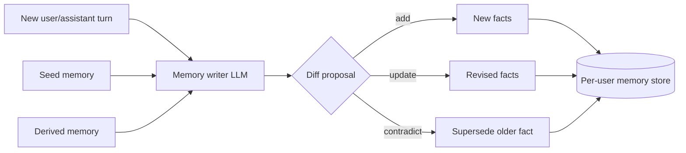
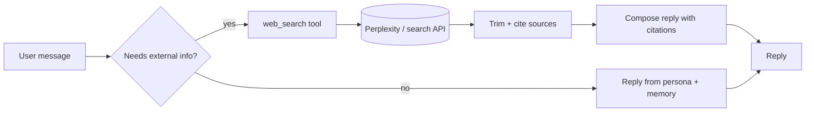

# Production notes — enhancements beyond the demo

The current app treats enrichment as a **one-shot event at onboarding** and chat as a **read-only consumer** of that snapshot. That’s great for a “wow” first message, but a real product needs the persona to **keep learning** from the conversation and to be able to **look things up** when it doesn’t already know. This doc sketches the two highest-leverage upgrades.

---

## 1. Per-user memory that evolves from chat

### What’s missing today

Right now:

- `persona_description` and `facts_sheet` are **written once** by the enrichment pipeline and stored on the user document in Mongo.
- Chat only **reads** them; it never writes back.
- Conversation history grows, but nothing in it ever becomes a durable fact or preference.

So if a user says “actually I live in Berlin now, not Bangalore” or “I hate spicy food,” the bot acknowledges it in that turn and forgets by next week — because the next reply still system-prompts from the stale persona + facts sheet built at onboarding.

### The shape of the fix

Treat memory as **three tiers**, not one blob:

1. **Seed memory** — what enrichment produces today (persona + facts sheet from Gmail + web). Treated as **prior**, not truth.
2. **Derived memory** — facts/preferences distilled **from chat turns**. Updated incrementally, with provenance.
3. **Working context** — the last N turns of raw history, already in use.

### How the update loop works

After each chat turn (or batched every few turns), run a small **memory writer** step:



The memory writer is a **separate, cheap LLM call** whose only job is to emit **structured diffs**:

```json
{
  "add": [{"key": "location.current_city", "value": "Berlin", "confidence": 0.8, "source_turn_id": "..."}],
  "update": [{"key": "food.spice_tolerance", "value": "low", "confidence": 0.7}],
  "supersede": [{"key": "location.current_city", "old": "Bangalore", "reason": "user corrected"}]
}
```

Key design choices worth copying in:

- **Typed keys, not free text** — a small namespaced schema (`location.*`, `food.*`, `work.*`, `relationships.*`) keeps the writer from inventing a new fact key per turn. You can grow the schema over time without corrupting older data.
- **Confidence + provenance on every entry** — so the chat layer can weight “user told me themselves” above “inferred from an email.”
- **Supersession, not deletion** — keep the old value with a timestamp and a `superseded_by` pointer. Useful for debugging and for honest edit history.
- **Idempotent writes** — the memory writer must be safe to re-run on the same turn without duplicating facts (dedupe by key + normalized value).

### How chat reads it

The system prompt stops being “persona + facts sheet” and becomes:

1. Persona paragraph (still from onboarding — tone memory).
2. **Merged facts view**: derived memory overrides seed memory where keys overlap; ties broken by confidence + recency.
3. A short list of **recent unresolved threads** (“user mentioned planning a trip; destination not confirmed”).

The “one concrete callback per reply” rule stays — it just now picks from a live view, not a static bullet list.

### What to build, concretely

- A `memories` collection keyed by `entity_id`, with one document per fact key (or per namespace).
- A `memory_writer` module with its own prompt and JSON schema, called from the chat pipeline **after** a reply is produced, not before (so it doesn’t block latency).
- A merge function (`get_effective_facts(entity_id)`) that the chat layer calls instead of reading `facts_sheet` directly.
- A migration path: on first chat after deploy, copy the existing `facts_sheet` entries into `memories` as seed facts with `source: "onboarding"`.

### Risks to plan for

- **Drift and hallucinated facts** — the writer will occasionally invent. Mitigate with: strict JSON schema, low temperature, explicit “only emit facts the user stated or strongly implied,” and a manual review surface for low-confidence writes before they influence chat.
- **Privacy asymmetry** — users expect chat to forget more readily than email-derived facts. Offer a “forget this” affordance that writes a supersede entry with `source: "user_request"`.
- **Compounding cost** — memory writes on every turn double LLM spend. Batch every N turns or trigger only when the writer’s cheap classifier flags the turn as fact-bearing.

---

## 2. Web browsing / live lookup tool

### Why the current design needs it

Perplexity runs **once** at onboarding and produces a snapshot. After that, the bot has no way to:

- Answer “did anything change about my company’s fundraising lately?”
- Resolve a question about a specific restaurant, airline, or product the user mentions mid-chat.
- Verify a claim the user makes before storing it as a memory fact.

So the persona can feel well-informed about *who the user was when they signed up* and completely blind to *anything in the world right now*.

### The shape of the fix

Add a **single, tightly scoped browsing tool** the chat model can call on demand — not a free-for-all agent loop.



Concretely, expose the tool via OpenAI function calling (or whatever chat API you’re on) with a minimal contract:

```json
{
  "name": "web_search",
  "description": "Look up a specific fact on the public web. Use only when the answer is time-sensitive, user-specific, or not already in memory.",
  "parameters": {
    "query": "string",
    "freshness": "day | week | month | any"
  }
}
```

Under the hood it’s one Perplexity/Tavily/Brave call, results trimmed to ~3 snippets with URLs. The model is instructed to cite at least one source when it uses the tool’s output.

### Design choices that matter

- **Pull, don’t push** — don’t run a search every turn. Let the model request it. Most turns are small talk and memory lookups; search is the exception.
- **Hard budget per conversation** — e.g. at most 3 tool calls per user message, 10 per session. Prevents runaway cost and “agentic” loops.
- **Reuse the Perplexity client you already have** — the enrichment code already knows how to talk to it; package that as a reusable module (`perplexity.search(query, freshness)`) and share it between onboarding and chat.
- **Feed tool results back into memory** — when a search yields a durable fact (“user’s company raised Series B in March”), pipe it through the same memory writer from section 1 so the next turn doesn’t need to search again.
- **Citations over claims** — in the reply, surface the URL if the fact came from a search, so the user can sanity-check. Builds trust for a product that already knows a lot about them.

### What to build, concretely

- A `tools/web_search.py` module with one function and one prompt describing when to use it.
- Wire it into the chat call as a function/tool definition.
- Add a simple per-session counter in Mongo (or Redis later) to enforce the call budget.
- Log every tool call with `{query, result_summary, used_in_reply}` for debugging prompt regressions.

### Risks to plan for

- **Latency** — a search adds 1–3 seconds. Stream the “thinking…” state to the UI so the user knows something’s happening.
- **Hallucinated citations** — models sometimes fabricate URLs. Mitigate by forcing citations to be chosen **only** from the tool’s returned list (validate before rendering).
- **Sensitive queries** — block the tool from searching anything that looks like personal info about the user themselves (their email, phone, financial data). Small allow/deny heuristic at the tool boundary is enough to start.

---

## Other natural next steps (briefer)

Not the focus of this doc, but worth naming because they compound with the two above:

- **Bucket query tuning** — the highest-leverage knob on enrichment quality is still the Gmail search strings, not the LLMs. A/B testing bucket queries per region/locale will move accuracy more than a bigger model.
- **Per-user privacy controls** — UI to show what categories informed the persona, with a “drop this bucket” and “forget everything” button. Writes supersede entries.
- **Re-enrichment on demand / schedule** — let users (or a background job) re-run enrichment monthly, merged via the same memory diff mechanism so it doesn’t clobber chat-derived facts.
- **Eval harness** — golden set of “given this mailbox + persona, expected first message qualities” so prompt changes don’t silently regress the wow moment.
- **Observability** — per-turn traces of (system prompt bytes, tool calls, memory writes, model, cost). Essential once memory and tools are in the loop; hard to debug “why did it say that” without it.

---

## TL;DR

Move from **one-shot snapshot + read-only chat** to:

1. **Living memory** — chat turns update a typed, provenance-tagged per-user store that overrides onboarding facts.
2. **On-demand browsing** — a single, budgeted `web_search` tool the model calls when memory isn’t enough, with results fed back into memory.

These two together turn the demo into a product: the bot stays specific **and** stays current, instead of freezing at the moment of sign-in.
